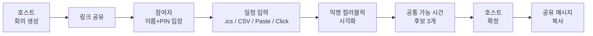
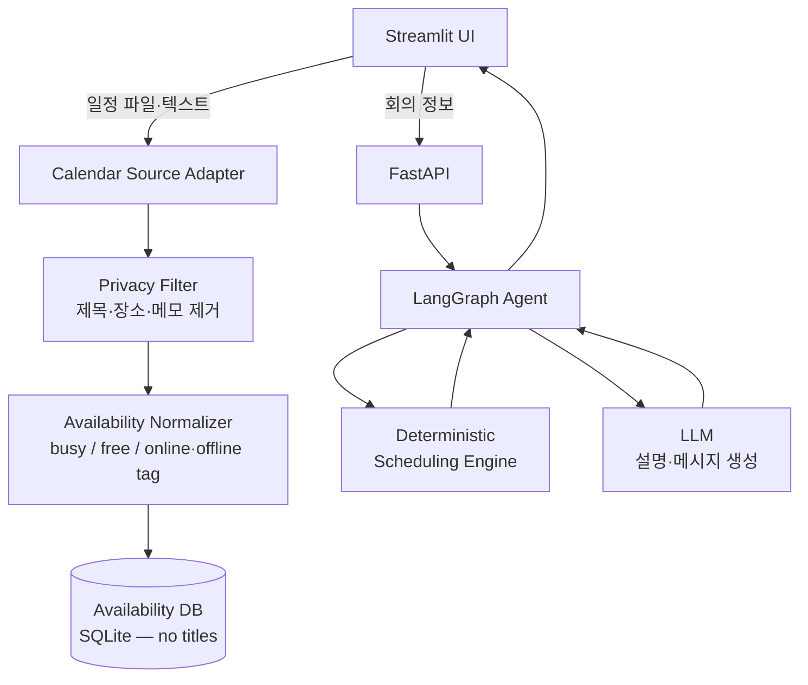

# 홍지연 기획서 초안

작성자: 홍지연
작성일: 2026-05-01

# 홍지연 프로젝트 기획서

참여자: 박세종, 안수빈, 이중곤, 지상근, 홍지연

## 1. 문제 정의 및 프로젝트 개요

### 프로젝트 한 줄 정의 [필수]

다양한 형식의 개인 일정 데이터를 Agent가 자동으로 익명 availability로 변환해, 소규모 그룹이 가장 빠르게 공통 가능 시간을 찾도록 돕는 **개인정보 보호 일정 조율 Agentic Workflow** 프로젝트.

### 서비스 한 줄 정의 [필수]

**"When2Meet의 익명성 + Google Calendar의 자동 입력"** 을 합친, 일정 세부 내용은 가리고 가능 시간만 빠르게 모아주는 그룹 일정 조율 서비스.

### 서비스 선정 배경 [권장]

소규모 그룹 일정 조율의 현재 두 가지 방식 모두 명확한 한계가 있다.

| 방식 | 장점 | 한계 |
|---|---|---|
| Google Calendar 공유 | 자동 입력, 정확함 | 일정 제목·장소까지 다 노출 |
| When2Meet | 익명성, 가벼움 | 시간 칸을 하나하나 클릭해야 함 |

→ "정보는 가리면서 입력은 자동인" 중간 지점이 비어 있다. 우리는 그 자리를 채운다.

### 해결하려는 문제 [필수]

- 캘린더 공유는 **개인 일정 세부 내용까지 노출**되어 부담스럽다.
- When2Meet 류는 **시간을 일일이 클릭**해야 해서 마찰이 크다.
- 사용자마다 **쓰는 캘린더가 제각각**(Google, Apple, 네이버, 수기 메모, 스크린샷) 이라 통일이 어렵다.
- 결과를 정리해 **확정·공유**하는 마지막 단계가 또 한 번의 잡일이 된다.

### 대상 사용자 [필수]

소규모(3~7명) 그룹 일정 조율이 잦은 **SW마에스트로 연수생, 팀원, 멘토, 코치, 엑스퍼트**.

### 핵심 가치 [필수]

**"프라이버시와 편의의 동시 충족"** — 일정 내용은 숨기되 입력 과정은 자동화한다. 가입 없이 **이름+PIN** 만으로 즉시 참여할 수 있어 마찰이 최소화된다.

## 2. 사용자 및 Agent 설계

### 타깃 사용자 페르소나 [권장]

- **호스트형 (조율 담당자)**: 5명 멘토링/스터디를 매주 잡아야 하는 팀장. 일정 조율이 본업이 아니라 빨리 끝내고 싶다.
- **참여자형**: 잠깐 들어와 가능 시간만 알려주고 떠나고 싶다. **가입은 절대 안 한다.**

### Agent의 역할 [필수]

Agent는 호스트의 **조율 보조자**다. 다음을 책임진다.

1. **다형 입력 정규화** — `.ics`, CSV, 텍스트 paste, (선택) 스크린샷 OCR 입력을 공통 availability schema로 변환
2. **결과 해석** — deterministic scheduling engine이 계산한 후보 시간을 자연어로 설명 ("4명 모두 가능, 1명은 온라인만 가능")
3. **공유 메시지 생성** — 후보 확정 시 단톡방에 붙여넣을 메시지 초안 작성
4. **예외 처리 안내** — 공통 가능 시간이 없을 때 차선책 후보 + 추가 질문 제안

### Agent의 성격 및 톤앤매너 [권장]

- 가볍고 친근한 조율 보조자. 정중하지만 짧게.
- 모든 결정은 호스트가 한다. Agent는 **선택지와 근거**만 제공.

### Agent의 자율성 범위 [필수]

| 자동 수행 | 자동 안 함 |
|---|---|
| 입력 형식 자동 감지·변환 | 외부 캘린더 OAuth 자동 연동 |
| 후보 시간 계산·정렬 | 자동 메시지 발송 |
| 추천 이유 설명 생성 | 사용자 승인 없는 일정 확정 |
| 공유 메시지 초안 작성 | 개인 일정 제목·장소·내용 저장 |

## 3. 핵심 기능 및 사용자 흐름

### 주요 사용자 시나리오 [필수]

> 팀장 A는 다음 주 안에 5명 회의를 1시간 잡아야 한다. 카톡에서 "다들 언제 돼요?" 묻기엔 답이 흩어지고, Google Calendar 공유는 부담스럽다.
>
> A는 SomaTime에서 회의를 만들고 링크를 공유한다. 팀원 4명은 **이름+PIN** 으로 들어와 자기 캘린더 export 파일·스크린샷을 올린다. Agent는 일정을 **익명 컬러블럭** 으로 보여주고, *"5/7(목) 14-15시는 5명 모두 가능, 5/8(금) 10-11시는 4명 가능(1명 온라인만)"* 식으로 후보 3개를 추천한다. A는 첫 후보를 확정하고, Agent가 만든 메시지를 단톡방에 붙여넣는다.

### 핵심 기능 정의 [필수]

1. **회의 생성** — 날짜 범위, 회의 길이(30/60분), 인원 수 입력
2. **이름+PIN 입장** — 가입 없이 회의별 링크 + 참여자가 정한 이름·PIN
3. **다형 일정 입력** — `.ics` upload / CSV·텍스트 paste / 직접 클릭 / (Stretch) 스크린샷 OCR
4. **익명 컬러블럭 시각화** — 일정 제목·장소 비공개. *누가, 어느 시간이 막혀있는지* 만 색으로 표시
5. **공통 가능 시간 계산** — 30분 그리드에서 모두/대부분 가능한 시간 추출
6. **온라인/오프라인 태깅** — 각 busy block에 `online-OK` / `offline-OK` / `both` 태그
7. **후보 추천 + 공유 메시지** — 후보 3개 + 추천 이유 + 카톡용 메시지 초안

### 사용자 관점 워크플로우 [필수]

### 시스템 관점 워크플로우 [권장]

핵심 분리 원칙: **계산은 deterministic engine, 설명은 LLM.** LLM이 시간을 지어내지 못하게 한다.

## 4. 기술 구현 설계

### 기술 스택 [필수]

- **Frontend / Demo UI** — Streamlit (컬러블럭은 `st.dataframe` + 색 매핑으로 빠르게 구현)
- **Backend API** — FastAPI
- **Agent Workflow** — LangGraph (입력 정규화 → 계산 → 메시지 생성 노드 분리)
- **LLM** — OpenAI API 또는 Upstage Solar API
- **Calendar Parsing** — `icalendar`, `python-dateutil`, `zoneinfo` / (Stretch) `pytesseract` OCR
- **Storage** — SQLite (회의 / 참여자 / availability blocks)
- **Scheduling Engine** — 자체 구현 Python 모듈 (30분 그리드 교집합 계산)

### 시스템 아키텍처 [권장]

위 "시스템 관점 워크플로우" 다이어그램 참고. **3계층 분리** 가 핵심:

1. **Input Layer** — 다형 입력 → Privacy Filter → 통일된 availability schema
2. **Computation Layer** — Deterministic scheduling engine (시간 계산은 규칙 기반)
3. **Presentation Layer** — LangGraph + LLM (설명·메시지·예외 처리는 자연어)

### 프롬프트 설계 전략 [권장]

- 모든 Agent 출력은 **Pydantic 스키마로 강제** (function calling / structured output)
- Few-shot 예시로 추천 메시지 톤 통제 ("간결, 카톡 풍, 이모지 1~2개")
- **LLM-as-Judge** 로 추천 메시지가 익명성을 위반하지 않는지(예: 일정 제목·장소가 유출됐는지) 자동 검증
- Temperature 운영 — 시간 계산/판단부 = 0.0 / 메시지 생성부 = 0.5~0.7

### 데이터 활용 및 기억 관리 [권장]

- 회의별 격리된 context. 회의 종료 후 availability 데이터는 옵션으로 **TTL 자동 삭제**
- 일정 원문 텍스트·제목은 **메모리에도 들어가지 않는다** (Privacy Filter가 입력 단계에서 제거)
- PIN은 hash 저장 (bcrypt 등)

### 제약사항 및 예외 처리 [필수]

- 모두 가능한 시간이 없으면 → "가장 적은 인원이 빠지는" 차선책 후보 제시
- 서로 다른 timezone 참여자 → 모두 **KST 기준으로 정규화** 후 표시
- 스크린샷 OCR 실패 → 자동으로 "직접 입력 / CSV paste" 대체 흐름 안내
- 입력 형식 인식 실패 → Agent가 추가 질문 (예: "이 행이 시작·종료 시간 맞나요?")
- 동시 편집 충돌 → availability는 read-mostly, **마지막 입력 우선**

## 5. 성과 평가 및 실행 계획

### 성공 지표(KPI) [권장]

- 5명 그룹 1회 회의 조율을 **5분 이내** 완료
- 참여자 입력 마찰 = **클릭 3회 이내** 로 일정 등록 가능
- 캘린더 입력 자동 정규화 **정확도 90%+** (`.ics`, CSV 기준)
- LLM-as-Judge 기준 **추천 메시지 익명성 위반 0건**

### MVP 범위 [필수]

**반드시 구현 (5/10 데모 제출 기준)**

- 회의 생성 (날짜 범위, 길이, 인원)
- 이름+PIN 입장
- 일정 입력 — `.ics` upload + 텍스트 paste(CSV) **2가지**
- 익명 컬러블럭 시각화 (Streamlit)
- 30분 그리드 공통 시간 계산
- 후보 3개 + 추천 이유 + 공유 메시지 생성
- 로컬 실행 README

**이번에 하지 않음**

- 스크린샷 OCR (시간 남으면 stretch goal)
- Google·Apple Calendar OAuth 실시간 연동
- 회원 가입·로그인
- 모바일 앱
- 알림·자동 메시지 발송
- 반복 일정 최적화

### 단계별 개발 로드맵 [필수]

| 기간 | Phase | 산출물 |
|---|---|---|
| **5/2 (토)** | 기획서 제출 | `제출본.md` 고정 |
| **5/3 ~ 5/5** | Phase 1 — 코어 백엔드 | availability schema, scheduling engine, ICS parser |
| **5/6 ~ 5/8** | Phase 2 — Agent + API | LangGraph workflow, FastAPI, 메시지 생성 |
| **5/8 ~ 5/9** | Phase 3 — Frontend 통합 | Streamlit UI, 컬러블럭 시각화, PIN 입장 |
| **5/10 (일)** | 데모 코드 제출 | 로컬 실행 가능한 통합 데모 |
| **5/11 ~ 5/13** | Phase 4 — 발표 준비 | 시연 시나리오, 슬라이드, 리허설 |
| **5/15 (금)** | 최종 발표 | 데모데이 |

### 기대 효과 [권장]

- 5명 멘토링·스터디 일정 조율 시간을 **10분에서 1분으로** 단축
- 캘린더 공유의 부담 없이 **익명 협업 문화** 정착
- 메신저 기반 조율의 흐트러진 응답을 **하나의 표** 로 통합
- 향후 *"조용한 협업 도구(low-friction collaboration)"* 라인의 출발점
